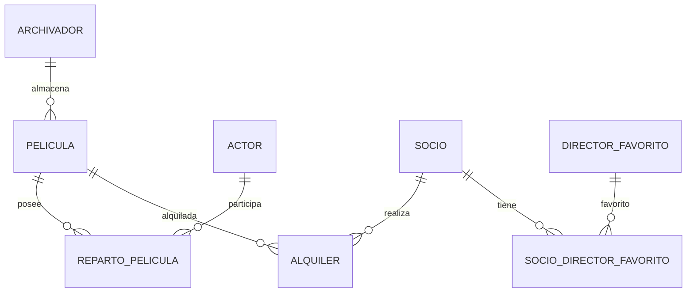

# Modelo Lógico de Tablas Relacionales

Este documento contiene la definición lógica de las tablas obtenidas a partir de la transformación del Modelo Entidad-Relación (DER) para la gestión del videoclub.

---

# Diagrama del Modelo Relacional (Mermaid)

El siguiente diagrama muestra las relaciones entre las tablas finales del sistema:



---

# Detalle de las Tablas

## 1. Tabla: Socio

Registra la información personal de los socios del videoclub.

| Atributo      | Tipo de Datos | Restricciones | Descripción                   |
| ------------- | ------------- | ------------- | ----------------------------- |
| id_socio (PK) | INT           | PRIMARY KEY   | Identificador único del socio |
| nombre        | VARCHAR(100)  | NOT NULL      | Nombre completo del socio     |
| direccion     | VARCHAR(150)  | NOT NULL      | Dirección de residencia       |
| telefono      | VARCHAR(20)   | NOT NULL      | Teléfono de contacto          |

---

## 2. Tabla: Director_Favorito

Registra los directores que pueden ser seleccionados como favoritos por los socios.

| Atributo                  | Tipo de Datos | Restricciones | Descripción                      |
| ------------------------- | ------------- | ------------- | -------------------------------- |
| id_director_favorito (PK) | INT           | PRIMARY KEY   | Identificador único del director |
| nombre_director           | VARCHAR(100)  | NOT NULL      | Nombre del director              |

---

## 3. Tabla: Socio_Director_Favorito

Resuelve la relación muchos a muchos entre Socio y Director_Favorito.

| Atributo                      | Tipo de Datos | Restricciones | Descripción                         |
| ----------------------------- | ------------- | ------------- | ----------------------------------- |
| id_socio (PK, FK)             | INT           | NOT NULL      | Identificador del socio             |
| id_director_favorito (PK, FK) | INT           | NOT NULL      | Identificador del director favorito |

### Clave Primaria Compuesta

(id_socio, id_director_favorito)

### Claves Foráneas

* id_socio → Socio(id_socio)
* id_director_favorito → Director_Favorito(id_director_favorito)

---

## 4. Tabla: Archivador

Registra los archivadores físicos donde se almacenan las películas.

| Atributo        | Tipo de Datos | Restricciones | Descripción                    |
| --------------- | ------------- | ------------- | ------------------------------ |
| num_serie (PK)  | VARCHAR(50)   | PRIMARY KEY   | Número de serie del archivador |
| ubicacion       | VARCHAR(100)  | NOT NULL      | Ubicación física               |
| num_estanterias | INT           | NOT NULL      | Cantidad de estanterías        |
| fecha_compra    | DATE          | NOT NULL      | Fecha de compra                |

---

## 5. Tabla: Pelicula

Registra las películas disponibles en el videoclub.

| Atributo                  | Tipo de Datos | Restricciones | Descripción                  |
| ------------------------- | ------------- | ------------- | ---------------------------- |
| titulo (PK)               | VARCHAR(150)  | NOT NULL      | Título de la película        |
| director (PK)             | VARCHAR(100)  | NOT NULL      | Director de la película      |
| anio (PK)                 | INT           | NOT NULL      | Año de estreno               |
| genero                    | VARCHAR(50)   | NOT NULL      | Género cinematográfico       |
| num_serie_archivador (FK) | VARCHAR(50)   | NOT NULL      | Archivador donde se almacena |

### Clave Primaria Compuesta

(titulo, director, anio)

### Clave Foránea

num_serie_archivador → Archivador(num_serie)

---

## 6. Tabla: Actor

Registra los actores del sistema.

| Atributo      | Tipo de Datos | Restricciones | Descripción             |
| ------------- | ------------- | ------------- | ----------------------- |
| id_actor (PK) | INT           | PRIMARY KEY   | Identificador del actor |
| nombre_actor  | VARCHAR(100)  | NOT NULL      | Nombre del actor        |

---

## 7. Tabla: Reparto_Pelicula

Resuelve la relación muchos a muchos entre Pelicula y Actor.

| Atributo                   | Tipo de Datos | Restricciones | Descripción             |
| -------------------------- | ------------- | ------------- | ----------------------- |
| titulo_pelicula (PK, FK)   | VARCHAR(150)  | NOT NULL      | Título de la película   |
| director_pelicula (PK, FK) | VARCHAR(100)  | NOT NULL      | Director de la película |
| anio_pelicula (PK, FK)     | INT           | NOT NULL      | Año de la película      |
| id_actor (PK, FK)          | INT           | NOT NULL      | Actor participante      |

### Clave Primaria Compuesta

(titulo_pelicula, director_pelicula, anio_pelicula, id_actor)

### Claves Foráneas

* (titulo_pelicula, director_pelicula, anio_pelicula)
  → Pelicula(titulo, director, anio)

* id_actor
  → Actor(id_actor)

---

## 8. Tabla: Alquiler

Registra el historial de alquileres realizados por los socios.

| Atributo                   | Tipo de Datos | Restricciones | Descripción                   |
| -------------------------- | ------------- | ------------- | ----------------------------- |
| id_socio (PK, FK)          | INT           | NOT NULL      | Socio que realiza el alquiler |
| titulo_pelicula (PK, FK)   | VARCHAR(150)  | NOT NULL      | Película alquilada            |
| director_pelicula (PK, FK) | VARCHAR(100)  | NOT NULL      | Director de la película       |
| anio_pelicula (PK, FK)     | INT           | NOT NULL      | Año de la película            |
| fecha_alquiler (PK)        | DATETIME      | NOT NULL      | Fecha del alquiler            |
| fecha_devolucion           | DATETIME      | NULL          | Fecha de devolución           |

### Clave Primaria Compuesta

(id_socio, titulo_pelicula, director_pelicula, anio_pelicula, fecha_alquiler)

### Claves Foráneas

* id_socio → Socio(id_socio)

* (titulo_pelicula, director_pelicula, anio_pelicula)
  → Pelicula(titulo, director, anio)

### Justificación

La inclusión de fecha_alquiler dentro de la clave primaria permite que un mismo socio pueda alquilar la misma película en diferentes momentos sin generar conflictos de identificación.

---

# Restricciones de Dominio Recomendadas

```sql
CHECK (anio >= 1888);

CHECK (num_estanterias > 0);

CHECK (
    fecha_devolucion IS NULL
    OR fecha_devolucion >= fecha_alquiler
);
```

Estas restricciones ayudan a mantener la calidad y consistencia de los datos almacenados.
