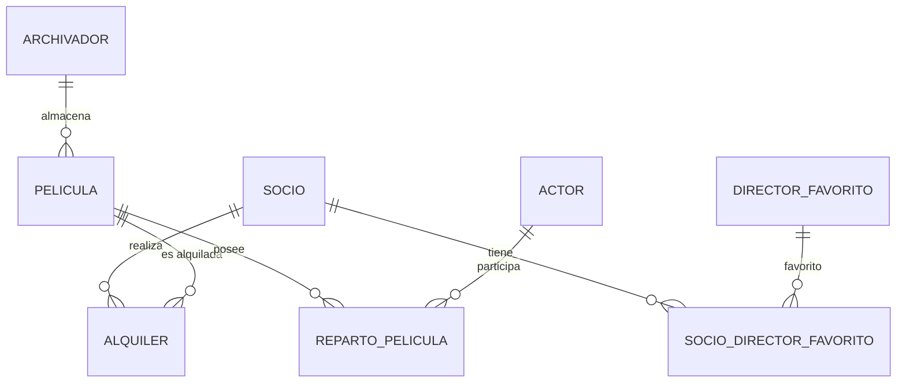

# Diseño de Base de Datos: Gestión de Videoclub

Este repositorio contiene el diseño conceptual, lógico y físico de una base de datos para la gestión de un videoclub. El sistema permite administrar el catálogo de películas, los socios registrados, los archivadores donde se almacenan las películas, los actores participantes en cada producción cinematográfica, los directores favoritos de los socios y el historial de alquileres realizados.

---

# Estructura del Repositorio

```text
videoclub/
│
├── README.md
│
├── diagramas/
│   └── DER_Videoclub.png
│
└── modelo_logico/
    ├── esquema.sql
    └── tablas_relacionales.md
```

---

# 1. Interpretación del Problema

El sistema de base de datos fue diseñado para satisfacer las necesidades operativas de un videoclub mediante la gestión integral de películas, socios y alquileres.

Los principales objetivos del sistema son:

### Gestión del Catálogo

Permitir el almacenamiento de películas evitando duplicidades mediante una identificación única basada en el título, director y año de estreno.

### Gestión del Inventario Físico

Controlar la ubicación física de las películas mediante archivadores identificados de forma única.

### Gestión de Socios

Registrar la información personal de los socios y sus preferencias cinematográficas.

### Gestión de Alquileres

Mantener un historial de los préstamos realizados por los socios y las devoluciones correspondientes.

---

# 2. Identificación de Entidades y Atributos

## A. Entidad: Socio

| Atributo  | Tipo           |
| --------- | -------------- |
| id_socio  | Clave Primaria |
| nombre    | Simple         |
| direccion | Simple         |
| telefono  | Simple         |

---

## B. Entidad: Pelicula

| Atributo | Tipo         |
| -------- | ------------ |
| titulo   | PK Compuesta |
| director | PK Compuesta |
| anio     | PK Compuesta |
| genero   | Simple       |
| actores  | Multivaluado |

---

## C. Entidad: Archivador

| Atributo        | Tipo           |
| --------------- | -------------- |
| num_serie       | Clave Primaria |
| ubicacion       | Simple         |
| num_estanterias | Simple         |
| fecha_compra    | Simple         |

---

## D. Entidad: Actor

| Atributo     | Tipo           |
| ------------ | -------------- |
| id_actor     | Clave Primaria |
| nombre_actor | Simple         |

---

## E. Entidad: Director_Favorito

| Atributo             | Tipo           |
| -------------------- | -------------- |
| id_director_favorito | Clave Primaria |
| nombre_director      | Simple         |

---

# 3. Justificación de Relaciones y Cardinalidades



## Archivador - Pelicula

### Cardinalidad: 1:N

Un archivador puede contener múltiples películas, mientras que cada película pertenece a un único archivador.

---

## Pelicula - Actor

### Cardinalidad: N:M

Una película puede tener varios actores y un actor puede participar en múltiples películas.

Esta relación se implementa mediante la tabla intermedia Reparto_Pelicula.

---

## Socio - Director Favorito

### Cardinalidad: N:M

Un socio puede tener varios directores favoritos y un mismo director puede ser favorito de varios socios.

Esta relación se implementa mediante la tabla intermedia Socio_Director_Favorito.

---

## Socio - Pelicula

### Cardinalidad: N:M

Un socio puede alquilar muchas películas y una película puede ser alquilada por distintos socios a lo largo del tiempo.

Esta relación se implementa mediante la tabla Alquiler.

---

# 4. Transformación al Modelo Relacional

## Entidades Principales

Las siguientes entidades se transformaron directamente en tablas:

* Socio
* Pelicula
* Archivador
* Actor
* Director_Favorito

---

## Resolución de Atributos Multivaluados

### Actores de una Película

Debido a que una película puede tener varios actores, se creó la tabla:

Reparto_Pelicula

Compuesta por:

* titulo_pelicula
* director_pelicula
* anio_pelicula
* id_actor

---

### Directores Favoritos de un Socio

Debido a que un socio puede tener varios directores favoritos, se creó la tabla:

Socio_Director_Favorito

Compuesta por:

* id_socio
* id_director_favorito

---

## Resolución de la Relación 1:N

La relación entre Archivador y Pelicula se resolvió incorporando:

num_serie_archivador

como clave foránea en la tabla Pelicula.

---

## Resolución de la Relación N:M

La relación de alquiler se resolvió mediante la tabla:

Alquiler

compuesta por:

* id_socio
* titulo_pelicula
* director_pelicula
* anio_pelicula
* fecha_alquiler
* fecha_devolucion

---

# 5. Decisiones de Diseño

## Uso de Clave Primaria Compuesta

La entidad Pelicula utiliza una clave primaria compuesta por:

* titulo
* director
* anio

Esta decisión se tomó porque pueden existir películas con el mismo título.

La combinación de estos tres atributos garantiza una identificación única.

---

## Uso de Tablas Intermedias

Para resolver relaciones N:M se implementaron las siguientes tablas:

* Reparto_Pelicula
* Socio_Director_Favorito
* Alquiler

Esto permite mantener la normalización y evitar redundancia de información.

---

## Integridad Referencial

Se implementaron claves foráneas para garantizar la consistencia de los datos.

Estas restricciones impiden:

* Asociar películas a archivadores inexistentes.
* Registrar alquileres de películas inexistentes.
* Relacionar actores con películas inexistentes.
* Relacionar socios con directores inexistentes.

---

## Restricciones de Dominio Recomendadas

```sql
CHECK (anio >= 1888)

CHECK (num_estanterias > 0)

CHECK (
    fecha_devolucion IS NULL
    OR fecha_devolucion >= fecha_alquiler
)
```

---

# Modelo Entidad Relación

La imagen del DER se encuentra en la carpeta:

```text
diagramas/DER_Videoclub.png
```

Para visualizarla dentro del repositorio:

```markdown

```

---

# Resultado Final

El modelo diseñado cumple con todos los requerimientos planteados para la gestión de un videoclub.

La solución implementada mantiene la integridad referencial, evita redundancias y proporciona una estructura escalable para la administración eficiente de socios, películas, actores, directores favoritos, archivadores y alquileres.
